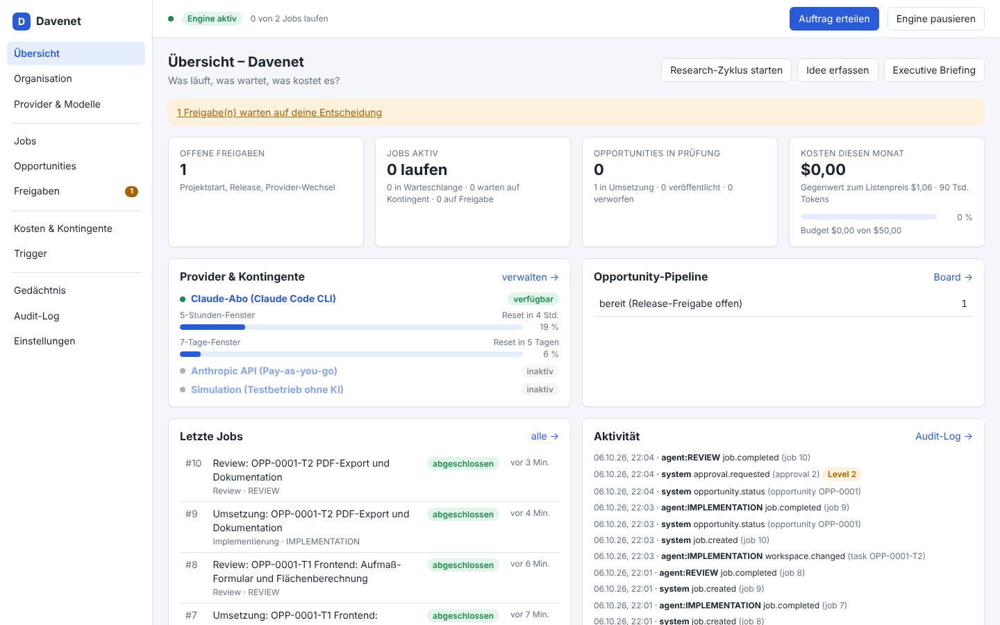
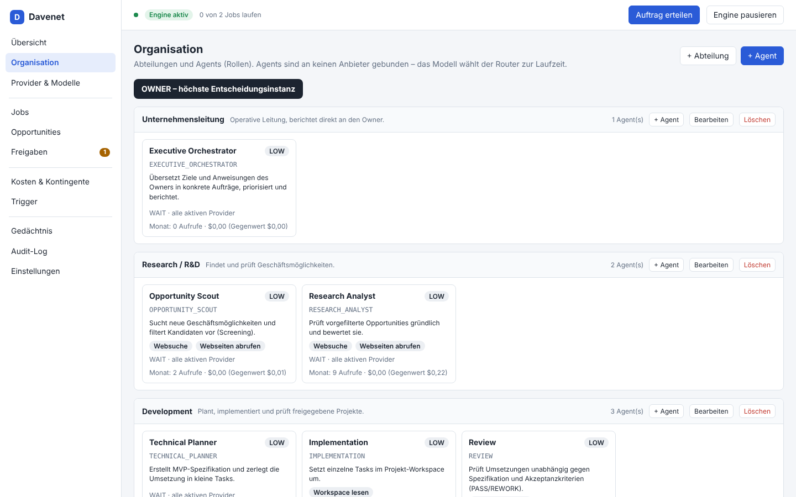
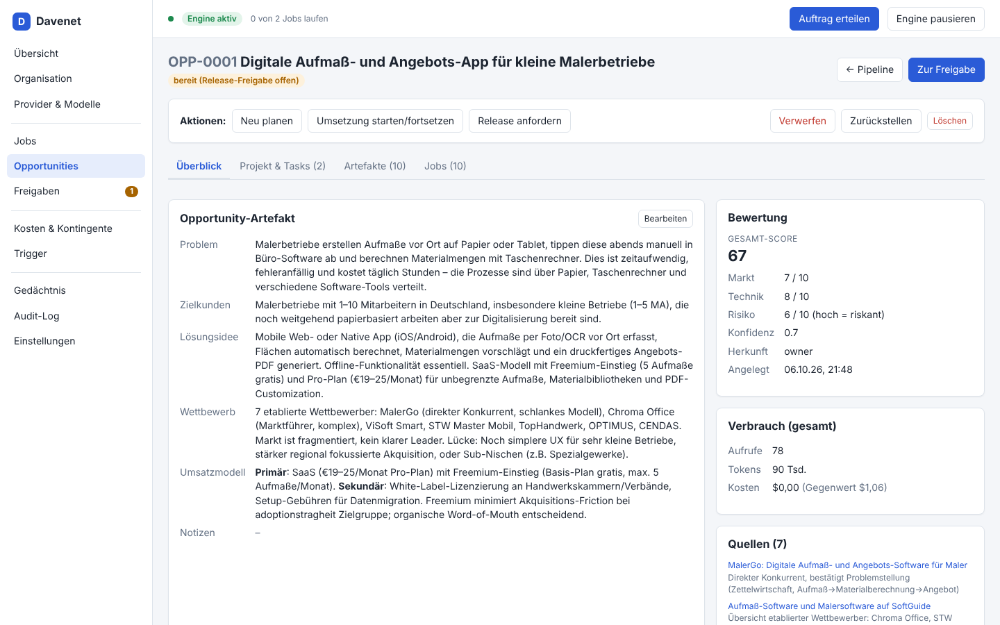
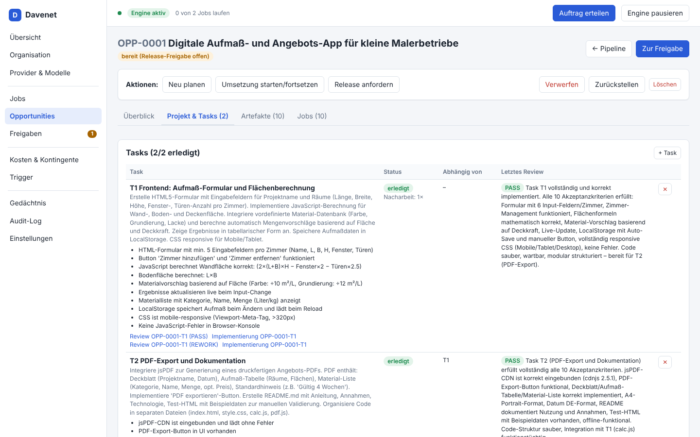
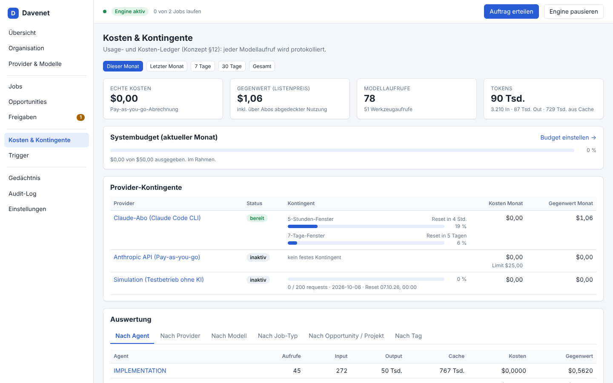

# Davenet

**Provider-unabhängiges Multi-Agent-Unternehmen** – eine lokale Software, die mit KI-Agents
Geschäftsmöglichkeiten recherchiert, bewertet und nach deiner Freigabe umsetzt. Agents sind
**Rollen** (Verantwortung, Berechtigungen, Limits), keine fest verdrahteten Modelle: Welches
Modell bei welchem Anbieter arbeitet, entscheidet ein zentraler Router zur Laufzeit – unter
Berücksichtigung von Kontingenten, Kosten und Policies.

Grundlage ist das Konzept [docs/KONZEPT.md](docs/KONZEPT.md); wie es umgesetzt ist, beschreibt
[docs/ARCHITEKTUR.md](docs/ARCHITEKTUR.md). Als Referenz diente
[StarNet](https://github.com/androoAGI/starnet) – Davenet ist eine eigenständige Umsetzung
(kein übernommener Code), die die geschäftskritische Logik (Jobs, Policies, Kontingente,
Freigaben, Unternehmensdaten, Audit) in eigenen Komponenten hält.



## Was Davenet heute kann

- **Organisation verwalten:** Abteilungen und Agents anlegen, bearbeiten, zusammenlegen;
  festlegen, welcher Agent welchen Arbeitsschritt übernimmt (Zuständigkeiten).
  Startaufstellung nach Konzept: Executive Orchestrator · Research (Scout, Analyst) ·
  Development (Planner, Implementation, Review) · Finance (Cost Controller, Auditor) · Design (Designer).
- **Provider-Router mit Capability-Klassen** (LOW/MEDIUM/HIGH) und den Policies `WAIT`,
  `FALLBACK_SAME_TIER`, `FALLBACK_ANY_ALLOWED`, `OWNER_APPROVAL`. Standard: Ist das Kontingent
  erschöpft, **wartet** der Job bis zum Reset – es wird nie implizit auf einen teureren Anbieter
  gewechselt.
- **Zunächst rein über Claude:**
  - *Claude-Abo* über die lokal angemeldete **Claude Code CLI** (Pro/Max-Plan). Davenet liest die
    von der CLI gemeldete Plan-Auslastung (5-Stunden- und 7-Tage-Fenster inkl. Reset-Zeit) und
    plant Jobs bei erreichtem Limit automatisch zum Reset neu ein.
  - *Anthropic API* (Pay-as-you-go, API-Key) mit monatlichem Kostenlimit – standardmäßig aus.
  - *Simulation* zum kostenlosen Ausprobieren aller Abläufe – standardmäßig aus.
  - Weitere Anbieter/Pläne (z. B. ein zweites Claude-Konto, Gemini, OpenRouter, Ollama) werden als
    zusätzlicher Provider-Typ ergänzt – Agents, Router und Ledger bleiben gleich.
- **Bilder** über einen eigenen Bild-Provider: *ChatGPT-Abo* über die lokal angemeldete
  **Codex CLI** (gpt-image-2, keine API-Kosten), alternativ die *OpenAI-Bild-API* mit API-Key und
  Kostenlimit oder eine *Bild-Simulation*. Agents fordern Bilder in ihren Ergebnissen an; sie
  landen im Gedächtnis (`/media`) und im Projekt-Workspace unter `assets/`.
- **Pipeline nach Konzept und Strategie:** Scan → Screening → Deep Research (mit Websuche und
  **Rechtsprüfung**) → **Bewertung nach 13 Kriterien mit K.-o.-Logik** → **Owner-Freigabe
  Nachfragetest** → Testpaket (Texte, Landingpage, Designs) → Test läuft, du erfasst das Ergebnis
  → Auswertung (bauen / einmal anpassen / beenden) → **Owner-Freigabe Projektstart** →
  MVP-Planung (Spec + Tasks) → Implementierung im Projekt-Workspace → Review (PASS/REWORK) →
  **Owner-Freigabe Release**.
- **Portfolio & Erträge:** Einnahmen, Ausgaben und deine Zeit je Produkt erfassen; Leitplanken
  (Testbudget, Fixkosten, höchstens N Tests/Projekte gleichzeitig, Owner-Zeit pro Woche) werden
  geprüft; **monatlicher Portfolio-Review** mit Empfehlung behalten/ausbauen/anpassen/beenden –
  „Beenden“ legt dir die Leitung als Freigabe vor.
- **Job-Queue** mit persistenten Zuständen, Prioritäten, Wiederaufnahme nach Neustart,
  Wiederholung bei vorübergehenden Fehlern, Abbrechen/Neustarten aus der Oberfläche.
- **Budget-first:** Limits pro Job (Kosten, Tokens, Tool-Aufrufe, Laufzeit), pro Agent
  (Monatsbudget), pro Provider (Kontingent/Kostenlimit) und für das Gesamtsystem (Budget mit
  Warnschwelle, ab der nur noch wichtige Jobs auf kostenpflichtigen Providern laufen).
- **Usage- & Kosten-Ledger:** jeder einzelne Modellaufruf mit Tokens, Cache, Werkzeugaufrufen,
  echten Kosten und Listenpreis-Gegenwert – auswertbar nach Agent, Provider, Modell, Job-Typ,
  Opportunity und Tag.
- **Unternehmensgedächtnis** als Dateien (`/strategy`, `/opportunities`, `/projects`, `/research`,
  `/finance`, `/decisions`, `/knowledge`, `/media`, `/audit`); Agents bekommen nur gekürzte, relevante
  Ausschnitte. Die Strategie steuert, wonach gesucht wird – bei langen Strategien erhalten die
  Agents eine Kurzfassung.
- **Freigaben & Audit-Log** mit Approval-Levels 0–3, **Zeit- und Ereignis-Trigger** (der monatliche
  Portfolio-Review ist von Anfang an aktiv, alle anderen Zeit-Trigger sind aus).

## Schnellstart

Voraussetzungen:

- **Node.js ≥ 22.13** (empfohlen: aktuelle LTS 22 oder 24)
- für das Claude-Abo: **Claude Code** installiert und einmal angemeldet
  (`claude` im Terminal starten, `/login`)
- alternativ/zusätzlich: ein Anthropic-API-Key

```bash
git clone https://github.com/dave6647/davenet.git
cd davenet
npm install
npm run build      # baut die Oberfläche
npm start          # startet Davenet auf http://localhost:4310
```

Für die Entwicklung (Server mit Neustart bei Änderungen + Vite mit Hot Reload):

```bash
npm run dev        # Oberfläche auf http://localhost:5173, API auf :4310
```

### Erste Schritte

1. **Strategie festlegen:** *Gedächtnis → strategy/strategie.md* ausfüllen (Ausrichtung,
   Suchfelder, Ausschlusskriterien, Ressourcen). Das ist der wichtigste Hebel für gute Ergebnisse.
   Ist die Strategie länger als das Kontextlimit (*Einstellungen*, Standard 8.000 Zeichen), lege
   zusätzlich eine Kurzfassung `strategy/kurzfassung.md` an (Button *Kurzfassung anlegen* im
   Gedächtnis) – die Agents erhalten dann diese. Die Übersicht meldet, wenn die Strategie gekürzt
   wird oder die Kurzfassung älter ist als die Langfassung.
2. **Provider prüfen:** *Provider & Modelle → Claude-Abo → Verbindung testen.* Ohne Claude Code
   alternativ den API-Provider aktivieren und einen Key hinterlegen.
3. **Arbeit anstoßen:** *Research-Zyklus starten*, eine eigene *Idee erfassen* oder oben rechts
   *Auftrag erteilen* (die Leitung zerlegt deinen Auftrag in Jobs).
4. **Entscheiden:** Unter *Freigaben* Nachfragetests, Projektstarts, Beenden und Releases
   freigeben oder ablehnen.
5. **Testen:** Nach der Test-Freigabe bereitet Davenet das Testpaket vor (Opportunity → *Test &
   Zahlen*). Deine Schritte erledigen, *Test ist live* klicken, Einnahmen/Ausgaben/Zeit buchen und
   am Ende *Ergebnis erfassen* – die Auswertung schlägt bauen, anpassen oder beenden vor.
6. **Beobachten:** *Portfolio & Erträge*, *Jobs*, *Kosten & Kontingente* und *Audit-Log* zeigen,
   was passiert. Die Leitplanken stellst du unter *Einstellungen* ein.

**Bilder über dein ChatGPT-Abo (optional):** Codex CLI installieren (`npm install -g @openai/codex`)
und einmal `codex login` → *Sign in with ChatGPT*. Dann *Provider & Modelle → ChatGPT-Abo (Codex
CLI) → Testen* und aktivieren. Ohne Abo: *OpenAI Bild-API* mit API-Key von platform.openai.com
(Abrechnung pro Bild, Kostenlimit $5/Monat voreingestellt). Ein ChatGPT-Abo enthält keinen
API-Zugang – deshalb läuft das Abo über die Codex CLI.

Zum gefahrlosen Ausprobieren: Provider *Simulation* aktivieren und das Claude-Abo deaktivieren –
dann laufen alle Abläufe mit Platzhalter-Ergebnissen ohne KI und ohne Kosten.

> Zeit-Trigger (z. B. wöchentlicher Research-Zyklus) sind anfangs **aus**, damit erst Verbrauch
> entsteht, wenn du sie bewusst unter *Trigger* aktivierst. Ausnahme: der monatliche
> Portfolio-Review (am 1. um 08:30).

### Einblicke

Organisation mit Abteilungen, Agents und Zuständigkeiten:



Eine echte, mit dem Claude-Abo durchlaufene Opportunity – Recherche mit Websuche, Bewertung,
Freigabe, Planung, Umsetzung und Review (inkl. einer Nacharbeitsrunde):




Kosten & Kontingente – über das Abo entstehen keine Kosten, der Listenpreis-Gegenwert und die von
der Claude-CLI gemeldete Plan-Auslastung (5 Stunden / 7 Tage) werden trotzdem angezeigt:



## Konzept → Umsetzung

| Konzept | In Davenet |
| --- | --- |
| §2 Organisationsmodell | *Organisation*: Abteilungen, Agents, Zuständigkeiten (Rollen zusammenlegen/aufteilen) |
| §3 Agent-Definition | Agent = Capability-Klasse, Mindest-Kontext, Werkzeuge, erlaubte Provider, Policy, Limits |
| §4 Router | `server/engine/router.ts`, Capability-Matrix unter *Provider & Modelle* |
| §5/§6 Kontingente & Warteschlange | Status `WAITING_FOR_PROVIDER_QUOTA`, Wiederaufnahme zum (gemeldeten oder berechneten) Reset |
| §7 Fallback-Policies | pro Agent und pro Job wählbar; `OWNER_APPROVAL` erzeugt eine Freigabe |
| §8–§10 Pipelines | Job-Typen in `server/engine/jobtypes/`, Board unter *Opportunities* |
| §11 Kontextstrategie | kompakte JSON-/Markdown-Artefakte, Kürzung nach Prioritäten, Input-/Output-Limits |
| §12 Ledger | Tabelle `usage_events`, Auswertung unter *Kosten & Kontingente* |
| §13 Gedächtnis | `data/company/…`, Browser/Editor unter *Gedächtnis* |
| §14 Approval Levels | Freigaben (Level 2), Audit-Log mit Level je Aktion; Agents haben keine Level-3-Werkzeuge |
| §15 Trigger | Zeit-Trigger + Ereignis-Trigger (Schwellen, Auto-Screening, Auto-Umsetzung) |
| §16 Zielarchitektur | Orchestrator, Job-Queue, Policy-Engine, Approvals, Router, Shared Services |

## Mehrere Pläne / Anbieter

- **Zweites Claude-Konto:** Neuen Provider vom Typ *Claude Code CLI* anlegen und als
  *Konfigurationsverzeichnis* einen eigenen Ordner angeben (`CLAUDE_CONFIG_DIR`). Einmal im
  Terminal mit `CLAUDE_CONFIG_DIR=<ordner> claude` anmelden. Danach z. B. im Agent beide Provider
  erlauben und die Policy `FALLBACK_SAME_TIER` wählen.
- **Anderer Anbieter:** einen Provider-Typ in `server/providers/` implementieren (Schnittstelle
  `ProviderAdapter` in `types.ts`: `call()` + `healthCheck()`; für Bilder `ImageAdapter` mit
  `generate()`) und in `registry.ts` registrieren. Die Oberfläche zeigt neue Typen automatisch an.
- **Bilder:** ChatGPT-Abo über die Codex CLI (für ein zweites Konto ein eigenes
  Codex-Verzeichnis `CODEX_HOME` angeben) oder die OpenAI-Bild-API. Bild-Jobs übernimmt der
  Agent *Designer*; sein Monatsbudget (Standard $5) begrenzt kostenpflichtige Bilder.

## Sicherheit

- Der Server lauscht nur auf `127.0.0.1`. Host-Header-Prüfung (DNS-Rebinding), schreibende
  Aufrufe brauchen den Header `X-Davenet` (CSRF), fremde Origins werden abgewiesen.
- API-Keys liegen lokal in `data/secrets.json` (Dateirechte 0600) und werden nie an die
  Oberfläche zurückgegeben.
- Agents über die Claude-CLI laufen mit strikt begrenzten Werkzeugen: keine Shell, keine
  MCP-Server, keine Nutzer-Einstellungen, Dateizugriff nur im Projekt-Workspace. Beim Abo-Provider
  wird ein evtl. gesetzter `ANTHROPIC_API_KEY` nicht weitergereicht (keine versehentlichen
  API-Kosten).
- Die Codex CLI läuft für Bilder mit Sandbox `read-only`, ohne Nutzer-Konfiguration und ohne
  `OPENAI_API_KEY` (Abo statt API-Kosten); Davenet übernimmt nur neu erzeugte Bilddateien.
  Bilder werden nur als Rasterformate (PNG, JPEG, WebP, GIF) an die Oberfläche ausgeliefert.
- Release/Deployment, Zahlungen, Verträge und Zugangsdaten bleiben beim Owner.

## Konfiguration

| Variable | Standard | Bedeutung |
| --- | --- | --- |
| `DAVENET_PORT` | `4310` | Port von API und Oberfläche |
| `DAVENET_HOST` | `127.0.0.1` | Bind-Adresse |
| `DAVENET_DATA_DIR` | `./data` | Datenbank, Gedächtnis, Workspaces, Secrets |
| `DAVENET_ALLOWED_HOSTS` | – | zusätzliche Hostnamen (kommagetrennt), falls nicht über localhost zugegriffen wird |

Alles andere (Budgets, Schwellen, Parallelität, Sprache …) unter *Einstellungen*.
Backup: den Ordner `data/` sichern.

## Projektstruktur

```
server/            Node/TypeScript-Backend
  db/              SQLite-Schema (node:sqlite), Startkonfiguration
  repo/            Datenzugriff
  providers/       Provider-Adapter (Claude CLI, Anthropic API, Codex CLI, OpenAI-Bild-API, Simulation) + Registry
  engine/          Orchestrator, Router, Kontingente, Scheduler, Runner, Job-Typen, Gedächtnis
  http/            REST-API, Server-Sent Events, Sicherheitsprüfungen
shared/            gemeinsame Typen/Begriffe für Server und Oberfläche
web/               React-Oberfläche (Vite)
test/              Tests (node:test)
docs/              Konzept, Architektur, Screenshots
```

## Tests & Qualität

```bash
npm run typecheck  # TypeScript (Server + Oberfläche)
npm test           # Engine-, Router-, Pipeline-, CLI-Adapter-, Bild- und API-Tests
npm run check      # alles inkl. Build
```

## Nächste Schritte (Vorschläge)

- Weitere Provider-Typen für Text (z. B. Codex CLI als zweites Abo, OpenAI-kompatible APIs)
- PNG-Export von SVG-Designs in Druckauflösung (für Print-on-Demand)
- Diagramme im Kosten-Dashboard, KPIs und Monatsziele (Konzept Phase 3)
- Deployment-Werkzeug als Level-2-Aktion hinter der Release-Freigabe
- Benachrichtigungen (z. B. E-Mail/Telegram) bei offenen Freigaben
